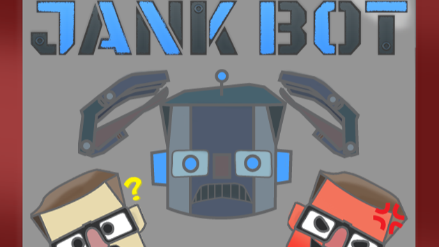

# Jank Bot

**Start Date:** January 2024  
**End Date:** January 2024

[Link to itch.io](https://sabishi-angel.itch.io/jankbot)  
_Video Excerpt:_ Link to itch.io

### Overview

Made a game with other jammers at Global Game Jam using Godot 4.

### Features

- In charge of **UI design** and programming in Godot 4, ensuring seamless **UX**, enhancing player engagement.
- Played a key role in designing and implementing skill-based challenges, contributing to the overall gameplay depth and variety.
- **Collaborated** closely with a diverse team including a project manager, a level designer, and an experienced senior software engineer, synergizing expertise to achieve project milestones effectively and efficiently.
- Successfully completed the project within the timeframe of the Global Game Jam 2024, showcasing proficiency in **meeting tight deadlines** while maintaining quality standards.
